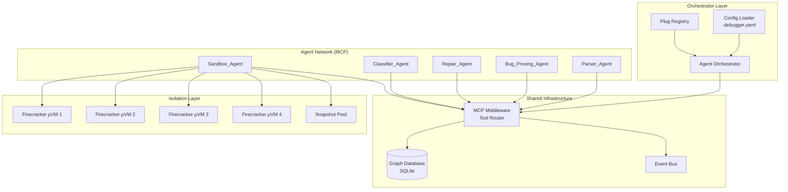
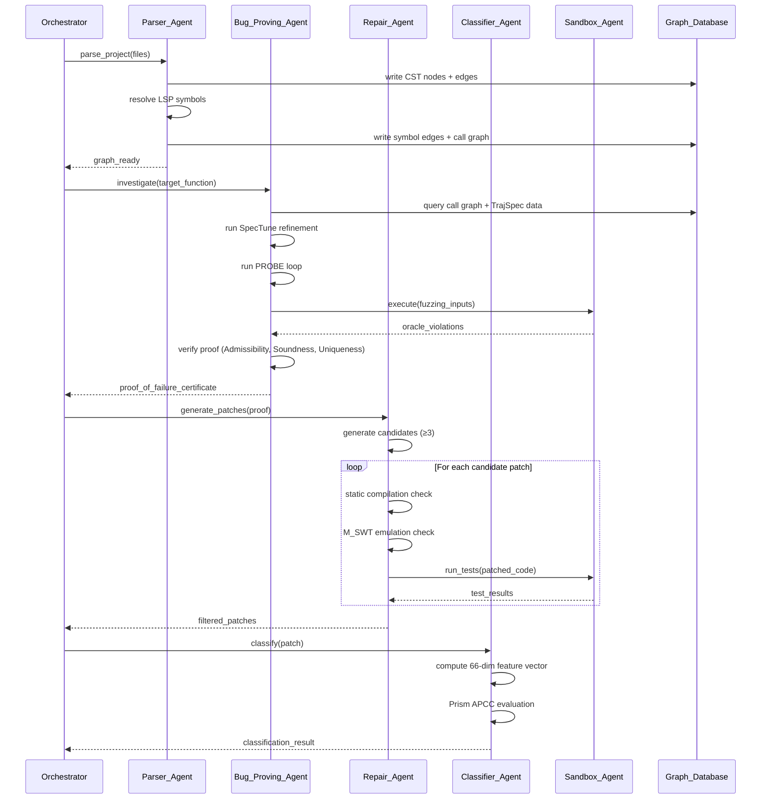
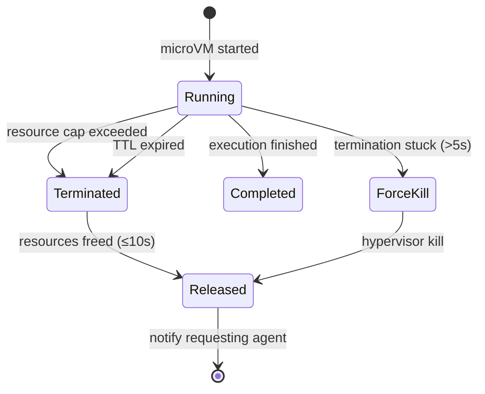

# Design Document: Proof-Carrying Program Repair and Debugging System

## Overview

This document describes the technical design for a Customizable, Proof-Carrying Program Repair and Debugging System operating as an autonomous multi-agent network over MCP (Model Context Protocol). The system parses source code into Concrete Syntax Trees (CSTs) via Tree-sitter, resolves cross-file symbols via LSP, stores semantic data in a SQLite graph database, refines specifications via TrajSpec and SpecTune, localizes defects through dynamic backward program slicing, hardens specifications via PROBE adversarial loops, generates differential tests, applies biased fuzzing, mathematically verifies proofs of failure, generates and filters candidate patches, detects overfitting, and executes all untrusted code in Firecracker microVMs.

The system is implemented in TypeScript and consists of 5 specialized agents (Parser_Agent, Bug_Proving_Agent, Repair_Agent, Classifier_Agent, Sandbox_Agent) communicating over MCP middleware. Configuration is loaded from `.debugger.yaml` with 4 extensible plug points.

### Key Design Decisions

1. **SQLite as graph store**: SQLite provides an embedded, zero-configuration database with WAL mode for concurrent reads. Graph semantics are modeled via an adjacency list pattern (nodes + edges tables) rather than a dedicated graph database, keeping deployment simple while supporting the required traversal queries via recursive CTEs.

2. **MCP as communication backbone**: The MCP TypeScript SDK (`@modelcontextprotocol/sdk`) provides typed tool definitions, JSON-RPC transport, and schema validation. Each agent registers as an MCP server exposing its capabilities, while the orchestrator acts as the MCP client routing requests.

3. **Firecracker for isolation**: Firecracker microVMs provide hardware-level isolation with sub-200ms snapshot restore via Copy-on-Write memory mappings. The TypeScript layer communicates with Firecracker's REST API over a Unix socket.

4. **Tree-sitter for parsing**: The `tree-sitter` Node.js binding provides incremental parsing with sub-millisecond edit re-parsing, fault-tolerant CST construction (error nodes for invalid regions), and whitespace/comment preservation.

5. **Layered filtering for repair quality**: A three-stage progressive filter (compile → emulate → test) eliminates invalid patches early, reducing expensive sandbox executions. Only patches surviving all stages reach the 66-dimensional overfitting classifier.

---

## Architecture

### High-Level System Architecture



### Investigation Pipeline Flow



---

## Components and Interfaces

### 1. Config Loader

Responsible for loading and validating `.debugger.yaml` at startup.

```typescript
interface DebuggerConfig {
  language: string;
  parser: ParserConfig;
  lsp: LspConfig;
  sandbox: SandboxConfig;
  oracles: OracleConfig;
  probe: ProbeConfig;
  plugs?: PlugConfig;
}

interface ParserConfig {
  command: string;
  grammar_path?: string;
}

interface LspConfig {
  command: string;
  initialization_options?: Record<string, unknown>;
}

interface SandboxConfig {
  runtime: string;
  memory_limit_mb: number;   // 64..8192
  timeout_seconds: number;   // 1..300
  egress_policy: 'deny' | 'allow_host_only';
}

interface OracleConfig {
  timeout_threshold_seconds: number;  // 1..300
  crash_detection: boolean;
  overflow_detection: boolean;
  determinism_check_count: number;    // 1..100
}

interface ProbeConfig {
  search_budget: number;
  max_refinement_iterations: number;
}

interface PlugConfig {
  parsing?: string;
  oracles?: string[];  // up to 8
  repair?: string;
  sandbox_executor?: string;
}
```

### 2. MCP Middleware (Tool Router)

Routes tool calls between agents with schema validation and timeout enforcement.

```typescript
interface McpToolDefinition {
  name: string;
  description: string;
  inputSchema: JsonSchema;
  handler: (params: unknown) => Promise<McpToolResult>;
}

interface McpToolResult {
  success: boolean;
  data?: unknown;
  error?: McpError;
}

interface McpError {
  type: 'validation_error' | 'execution_error' | 'timeout_error';
  message: string;
  tool_name: string;
}

// Exposed MCP Tools
type McpToolName =
  | 'read_range'
  | 'get_classes_and_methods'
  | 'extract_method'
  | 'extract_tests'
  | 'search_codebase'
  | 'find_similar_api_calls'
  | 'write_fix'
  | 'run_tests';
```

### 3. Parser_Agent

Parses source files into CSTs, resolves symbols via LSP, and writes to the Graph Database.

```typescript
interface ParserAgent {
  parseFile(filePath: string): Promise<ParseResult>;
  parseIncremental(filePath: string, edit: TreeSitterEdit): Promise<ParseResult>;
  resolveSymbols(filePath: string): Promise<SymbolResolutionResult>;
  buildCallGraph(): Promise<CallGraphResult>;
}

interface ParseResult {
  cst: CstNode;
  errors: SyntaxError[];
  duration_ms: number;
  file_path: string;
}

interface CstNode {
  id: string;
  type: string;
  start_byte: number;
  end_byte: number;
  start_position: Position;
  end_position: Position;
  children: CstNode[];
  is_error: boolean;
  text?: string;  // preserved whitespace/comments
}

interface TreeSitterEdit {
  start_byte: number;
  old_end_byte: number;
  new_end_byte: number;
  start_position: Position;
  old_end_position: Position;
  new_end_position: Position;
}

interface SymbolResolution {
  usage_site: SourceLocation;
  definition_site: SourceLocation | null;
  type_info: string | null;
  enclosing_scope: string | null;
  resolved: boolean;
}
```

### 4. Bug_Proving_Agent

Orchestrates specification refinement, adversarial testing, fuzzing, and proof verification.

```typescript
interface BugProvingAgent {
  investigate(target: InvestigationTarget): Promise<InvestigationResult>;
  runTrajSpec(repoPath: string): Promise<TrajSpecOutput>;
  runSpecTune(postconditions: Postcondition[], testSuite: TestSuite): Promise<SpecTuneResult>;
  runProbeLoop(property: CandidateProperty): Promise<ProbeResult>;
  runDiffTestGen(implementations: Implementation[]): Promise<DiffTestResult>;
  runSAFuzz(regions: CodeRegion[], seeds: TestInput[]): Promise<FuzzResult>;
  verifyProof(candidate: ProofCandidate): Promise<ProofVerificationResult>;
}

interface InvestigationTarget {
  function_id: string;
  file_path: string;
  specification: FunctionSpec;
}

interface ProofOfFailureCertificate {
  test_input: unknown;
  observed_output: unknown;
  violated_postcondition: string;
  admissibility_verified_at: string;
  soundness_verified_at: string;
  uniqueness_verified_at: string;
}

interface ProbeResult {
  status: 'verified' | 'inconclusive';
  property: CandidateProperty;
  iterations_completed: number;
  refinement_history: ProbeRefinement[];
  last_counter_implementation?: string;
}

interface FuzzResult {
  status: 'violation_found' | 'inconclusive';
  violations: FuzzViolation[];
  mutations_attempted: number;
  budget_remaining: number;
}

interface FuzzViolation {
  input: unknown;
  mutation_operator: 'Insert' | 'Overwrite' | 'Splice';
  oracle_type: OracleType;
  seed_input: unknown;
}
```

### 5. Repair_Agent

Generates and refines candidate patches using MCP file tools.

```typescript
interface RepairAgent {
  generatePatches(proof: ProofOfFailureCertificate, context: DefectContext): Promise<PatchCandidate[]>;
  refinePatch(patch: PatchCandidate, feedback: StageFeedback): Promise<PatchCandidate>;
}

interface DefectContext {
  defect_line: number;
  file_path: string;
  context_window: CodeRange;  // ±10 lines
  variable_states: VariableState[];
  specification: FunctionSpec;
}

interface PatchCandidate {
  id: string;
  diff: string;
  edit_operations: AstEditOperation[];
  target_file: string;
  target_range: CodeRange;
  refinement_attempt: number;  // 0..3
}

interface AstEditOperation {
  type: 'insert' | 'delete' | 'replace' | 'move';
  node_type: string;
  location: SourceLocation;
}
```

### 6. Classifier_Agent

Computes 66-dimensional feature vectors and evaluates overfitting via Prism APCC.

```typescript
interface ClassifierAgent {
  classify(patch: PatchCandidate, original: CstNode): Promise<ClassificationResult>;
}

interface AstDifferenceVector {
  // 11 properties per edit state
  properties: number[];  // length: 11
}

interface SemanticFeatureVector {
  gen: AstDifferenceVector;    // Generated nodes
  del: AstDifferenceVector;    // Deleted nodes
  remain: AstDifferenceVector; // Remaining nodes
  combined: number[];          // length: 66 (11 × 3 × 2)
}

interface ClassificationResult {
  approved: boolean;
  overfitting_probability: number;  // 0.0..1.0
  top_contributing_properties?: AstProperty[];  // top 3 if rejected
  patch_id: string;
}
```

### 7. Sandbox_Agent

Manages Firecracker microVM lifecycle, snapshot pools, and circuit breakers.

```typescript
interface SandboxAgent {
  execute(request: ExecutionRequest): Promise<ExecutionResult>;
  createSnapshot(config: RuntimeConfig): Promise<SnapshotId>;
  destroyInstance(instanceId: string): Promise<void>;
}

interface ExecutionRequest {
  code: string;
  runtime: string;
  oap_passport: OapPassport;
  resource_limits: ResourceLimits;
  oracles: OracleType[];
}

interface ResourceLimits {
  vcpus: number;          // max 2
  memory_mb: number;      // max 512
  disk_mb: number;        // max 10240
  ttl_seconds: number;    // max 600
  cpu_time_seconds: number; // max 300
  disk_io_mb: number;     // max 1024
}

interface OapPassport {
  agent_id: string;
  permitted_operations: string[];
  issued_at: string;
  expires_at: string;
}

interface ExecutionResult {
  status: 'completed' | 'timeout' | 'crashed' | 'resource_exceeded' | 'error';
  output?: unknown;
  oracle_violations: OracleViolation[];
  duration_ms: number;
  resource_usage: ResourceUsage;
}

interface OracleViolation {
  oracle_id: OracleType;
  timestamp: string;
  details: TimeoutDetails | CrashDetails | DeterminismDetails | OverflowDetails;
}

type OracleType = 'timeout' | 'crash' | 'determinism' | 'overflow';
```

### 8. Plug System

Defines the 4 extensible plug interfaces.

```typescript
interface ParsingPlug {
  parse(source: string, filePath: string): Promise<CstNode>;
  parseIncremental(source: string, edit: TreeSitterEdit, previousTree: CstNode): Promise<CstNode>;
}

interface OraclePlug {
  name: string;
  monitor(executionStep: ExecutionStep): Promise<OracleViolation | null>;
  onFailure(): void;
}

interface RepairPlug {
  generateCandidates(context: DefectContext): Promise<PatchCandidate[]>;
  refine(patch: PatchCandidate, feedback: StageFeedback): Promise<PatchCandidate>;
}

interface SandboxExecutorPlug {
  execute(request: ExecutionRequest): Promise<ExecutionResult>;
  configure(config: SandboxConfig): Promise<void>;
}

interface PlugRegistry {
  registerParsing(plug: ParsingPlug): void;
  registerOracle(plug: OraclePlug): void;    // up to 8
  registerRepair(plug: RepairPlug): void;
  registerSandboxExecutor(plug: SandboxExecutorPlug): void;
  validate(plug: unknown, interfaceName: string): ValidationResult;
}
```

### 9. Agent Orchestrator

Coordinates the investigation pipeline across all agents.

```typescript
interface AgentOrchestrator {
  startInvestigation(target: InvestigationTarget): Promise<InvestigationReport>;
  getStatus(investigationId: string): InvestigationStatus;
  halt(investigationId: string): void;
}

interface InvestigationReport {
  id: string;
  status: 'confirmed_and_repaired' | 'confirmed_no_repair' | 'unconfirmed' | 'halted';
  proof?: ProofOfFailureCertificate;
  approved_patches: ClassifiedPatch[];
  rejected_patches: RejectedPatch[];
  intermediate_results: IntermediateResults;
  timeline: PhaseTimestamp[];
}

interface PhaseTimestamp {
  phase: 'parsing' | 'proving' | 'repair' | 'classification';
  started_at: string;
  completed_at: string;
  agent: string;
}
```

---

## Data Models

### Graph Database Schema (SQLite)

```sql
-- Core node table for CST nodes and symbols
CREATE TABLE nodes (
  id TEXT PRIMARY KEY,
  type TEXT NOT NULL,           -- 'cst_node' | 'symbol_def' | 'function' | 'class' | 'method'
  file_path TEXT NOT NULL,
  start_byte INTEGER NOT NULL,
  end_byte INTEGER NOT NULL,
  start_line INTEGER NOT NULL,
  start_column INTEGER NOT NULL,
  end_line INTEGER NOT NULL,
  end_column INTEGER NOT NULL,
  node_kind TEXT,              -- Tree-sitter node kind
  text_content TEXT,           -- Preserved source text (whitespace, comments)
  is_error INTEGER DEFAULT 0,
  metadata TEXT,               -- JSON blob for extensible properties
  created_at TEXT NOT NULL DEFAULT (datetime('now'))
);

-- Edge table for relationships
CREATE TABLE edges (
  id TEXT PRIMARY KEY,
  source_id TEXT NOT NULL REFERENCES nodes(id),
  target_id TEXT NOT NULL REFERENCES nodes(id),
  relationship TEXT NOT NULL,  -- 'parent_of' | 'calls' | 'references' | 'defines' | 'type_of'
  metadata TEXT,               -- JSON for edge properties
  created_at TEXT NOT NULL DEFAULT (datetime('now')),
  UNIQUE(source_id, target_id, relationship)
);

-- Symbol resolution table
CREATE TABLE symbol_resolutions (
  id TEXT PRIMARY KEY,
  usage_node_id TEXT NOT NULL REFERENCES nodes(id),
  definition_node_id TEXT REFERENCES nodes(id),  -- NULL if unresolved
  symbol_name TEXT NOT NULL,
  type_info TEXT,
  enclosing_scope TEXT,
  resolved INTEGER NOT NULL DEFAULT 0,
  created_at TEXT NOT NULL DEFAULT (datetime('now'))
);

-- TrajSpec behavioral interpretations
CREATE TABLE behavioral_interpretations (
  id TEXT PRIMARY KEY,
  file_path TEXT NOT NULL,
  function_scope TEXT NOT NULL,
  summary TEXT NOT NULL,
  commit_ids TEXT NOT NULL,    -- JSON array
  defect_correlation_score REAL,
  created_at TEXT NOT NULL DEFAULT (datetime('now'))
);

-- TrajSpec diagnostic assertions
CREATE TABLE diagnostic_assertions (
  id TEXT PRIMARY KEY,
  interpretation_id TEXT REFERENCES behavioral_interpretations(id),
  function_id TEXT NOT NULL,
  precondition TEXT NOT NULL,
  postcondition TEXT NOT NULL,
  created_at TEXT NOT NULL DEFAULT (datetime('now'))
);

-- Specification refinement records
CREATE TABLE spec_refinements (
  id TEXT PRIMARY KEY,
  function_id TEXT NOT NULL,
  postcondition TEXT NOT NULL,
  alpha_consistency REAL NOT NULL,
  status TEXT NOT NULL,        -- 'fully_consistent' | 'partially_consistent' | 'discarded'
  disagreeing_tests TEXT,      -- JSON array of test IDs
  created_at TEXT NOT NULL DEFAULT (datetime('now'))
);

-- PROBE loop history
CREATE TABLE probe_iterations (
  id TEXT PRIMARY KEY,
  property_id TEXT NOT NULL,
  iteration_number INTEGER NOT NULL,
  candidate_property TEXT NOT NULL,
  counter_implementation TEXT,
  status TEXT NOT NULL,        -- 'refined' | 'verified' | 'inconclusive'
  created_at TEXT NOT NULL DEFAULT (datetime('now'))
);

-- Proof-of-failure certificates
CREATE TABLE proof_certificates (
  id TEXT PRIMARY KEY,
  investigation_id TEXT NOT NULL,
  test_input TEXT NOT NULL,
  observed_output TEXT NOT NULL,
  violated_postcondition TEXT NOT NULL,
  admissibility_verified_at TEXT NOT NULL,
  soundness_verified_at TEXT NOT NULL,
  uniqueness_verified_at TEXT NOT NULL,
  created_at TEXT NOT NULL DEFAULT (datetime('now'))
);

-- Candidate patches
CREATE TABLE patches (
  id TEXT PRIMARY KEY,
  proof_certificate_id TEXT NOT NULL REFERENCES proof_certificates(id),
  diff TEXT NOT NULL,
  edit_operations TEXT NOT NULL,  -- JSON array
  target_file TEXT NOT NULL,
  target_range TEXT NOT NULL,     -- JSON {start_line, end_line}
  status TEXT NOT NULL,           -- 'pending' | 'compilation_failed' | 'emulation_failed' | 'test_failed' | 'classified' | 'approved' | 'rejected'
  overfitting_probability REAL,
  feature_vector TEXT,            -- JSON array of 66 floats
  refinement_attempt INTEGER DEFAULT 0,
  failure_reason TEXT,
  created_at TEXT NOT NULL DEFAULT (datetime('now'))
);

-- Oracle violations
CREATE TABLE oracle_violations (
  id TEXT PRIMARY KEY,
  execution_id TEXT NOT NULL,
  oracle_type TEXT NOT NULL,     -- 'timeout' | 'crash' | 'determinism' | 'overflow'
  timestamp TEXT NOT NULL,
  details TEXT NOT NULL,         -- JSON
  created_at TEXT NOT NULL DEFAULT (datetime('now'))
);

-- Indexes for common query patterns
CREATE INDEX idx_nodes_file ON nodes(file_path);
CREATE INDEX idx_nodes_type ON nodes(type);
CREATE INDEX idx_edges_source ON edges(source_id);
CREATE INDEX idx_edges_target ON edges(target_id);
CREATE INDEX idx_edges_relationship ON edges(relationship);
CREATE INDEX idx_symbols_resolved ON symbol_resolutions(resolved);
CREATE INDEX idx_interpretations_file ON behavioral_interpretations(file_path);
CREATE INDEX idx_patches_status ON patches(status);
```

### Key Data Structures

```typescript
// Dynamic backward slice output
interface BackwardSlice {
  violation_point: SourceLocation;
  statements: SliceStatement[];  // ordered from violation point backward
  truncated: boolean;
  defect_line?: DefectLine;
}

interface SliceStatement {
  location: SourceLocation;
  variables: CapturedVariable[];
}

interface CapturedVariable {
  name: string;
  actual_value: unknown;
  expected_value?: unknown;  // derived from postcondition
  diverges: boolean;
}

interface DefectLine {
  line_number: number;
  file_path: string;
  divergent_variables: DivergentVariable[];
}

interface DivergentVariable {
  name: string;
  actual_value: unknown;
  expected_value: unknown;
}

// M_SWT transition model
interface StateTransition {
  from_state: ProgramState;
  to_state: ProgramState;
  statement: SourceLocation;
  variables_modified: string[];
}

interface ProgramState {
  variables: Map<string, unknown>;
  call_stack_depth: number;
  heap_allocations: number;
}

// SAFuzz mutation
interface Mutation {
  operator: 'Insert' | 'Overwrite' | 'Splice';
  position: number;
  tokens: string[];
  seed_input_id: string;
}

// Investigation status
interface InvestigationStatus {
  id: string;
  phase: 'parsing' | 'proving' | 'repair' | 'classification' | 'completed' | 'halted';
  current_agent: string;
  started_at: string;
  elapsed_ms: number;
  intermediate_results: IntermediateResults;
}

interface IntermediateResults {
  cst_nodes_parsed?: number;
  symbols_resolved?: number;
  specifications_refined?: number;
  probe_iterations?: number;
  fuzz_mutations?: number;
  patches_generated?: number;
  patches_approved?: number;
}
```

---


## Correctness Properties

*A property is a characteristic or behavior that should hold true across all valid executions of a system — essentially, a formal statement about what the system should do. Properties serve as the bridge between human-readable specifications and machine-verifiable correctness guarantees.*

### Property 1: CST Round-Trip Preservation

*For any* valid source file, parsing the file into a CST and reconstructing the source text from all CST leaf nodes (including whitespace and comment nodes) shall produce a byte-for-byte identical copy of the original source file.

**Validates: Requirements 1.1, 1.4**

### Property 2: Fault-Tolerant Parsing with Error Nodes

*For any* source file containing one or more syntax errors, the Parser_Agent shall produce a partial CST where: (a) every syntactically valid region is covered by non-error nodes whose byte ranges correspond exactly to the valid source regions, and (b) every erroneous region is represented by an error node whose byte offset and length exactly span the invalid region.

**Validates: Requirements 1.2**

### Property 3: Incremental Parse Equivalence

*For any* previously parsed source file and any valid edit (insertion, deletion, or replacement at any byte position), the CST produced by incremental re-parsing shall be structurally identical to the CST produced by a full re-parse of the edited file.

**Validates: Requirements 1.3**

### Property 4: Symbol Resolution Graph Correctness

*For any* symbol reference in a parsed file, if the LSP resolves the symbol then the Graph_Database shall contain an edge from the usage node to the definition node with correct type; if the LSP fails to resolve it, the symbol_resolutions table shall contain a record with resolved=false and the correct source location.

**Validates: Requirements 2.2, 2.3**

### Property 5: Call Graph Completeness

*For any* set of resolved function/method call edges stored in the Graph_Database, the constructed call graph shall contain a directed edge for every unique caller-callee pair and no edges for unresolved references.

**Validates: Requirements 2.5**

### Property 6: Referential Integrity Enforcement

*For any* write operation to the edges table where source_id or target_id does not exist in the nodes table, the Graph_Database shall reject the write and return an error identifying the missing target node, leaving the database state unchanged.

**Validates: Requirements 3.4**

### Property 7: Graph Query Correctness

*For any* valid graph state and query (node lookup, edge traversal, subgraph extraction, or path query), the Graph_Database shall return exactly the set of nodes and edges matching the query criteria — no more, no less.

**Validates: Requirements 3.2**

### Property 8: Defect Correlation Score Computation

*For any* code region with N total commits and D defect-fixing commits (where N > 0), the TrajSpec defect_correlation_score shall equal D/N, yielding a value in [0.0, 1.0].

**Validates: Requirements 4.3**

### Property 9: Alpha-Consistency Computation and Classification

*For any* candidate postcondition evaluated against T total passing test cases where A test cases agree with the postcondition: (a) the Alpha_Consistency value shall equal A/T, (b) if A/T = 1.0 the postcondition is marked 'fully_consistent', (c) if A/T < configurable threshold it is marked 'discarded' with disagreeing test IDs returned, and (d) if threshold ≤ A/T < 1.0 it is marked 'partially_consistent'.

**Validates: Requirements 5.2, 5.3, 5.4, 5.5**

### Property 10: Backward Slice Defect Line Identification

*For any* execution trace violating a postcondition, the backward slice shall contain the set of statements influencing the violated variable, and the identified defect line shall be the earliest statement in the slice where a variable's actual value diverges from the postcondition-required value.

**Validates: Requirements 6.1, 6.3**

### Property 11: Defect Report Completeness

*For any* identified defect line, the structured report shall contain exactly: line_number, file_path, divergent_variable_names (non-empty list), actual_values, and expected_values (derived from the postcondition).

**Validates: Requirements 6.4**

### Property 12: PROBE Refinement Excludes Counter-Implementations

*For any* candidate property P and counter-implementation C that satisfies P, the refined property P' produced by the Generator Agent shall not admit C (i.e., C shall violate P').

**Validates: Requirements 7.3**

### Property 13: Behavioral Difference Severity Prioritization

*For any* set of detected behavioral differences containing both specification-violating and unspecified-behavior differences, the reported results shall order all specification-violating differences before unspecified-behavior differences.

**Validates: Requirements 8.3**

### Property 14: SAFuzz Mutation Operator Correctness

*For any* seed input of length L tokens: (a) Insert produces an output of length L+K where 1 ≤ K ≤ 10, (b) Overwrite produces an output of length L with between 1 and 10 contiguous tokens replaced, and (c) Splice produces an output that is a recombination of token subsequences from exactly two seed inputs.

**Validates: Requirements 9.2**

### Property 15: SAFuzz Region Allocation Bias

*For any* SAFuzz campaign targeting defect-correlated and non-correlated regions, at least 70% of total mutation attempts shall target defect-correlated regions.

**Validates: Requirements 9.4**

### Property 16: Oracle Violation Record Completeness

*For any* oracle violation (timeout, crash, determinism, or overflow), the recorded violation shall contain: oracle_id matching the oracle type, a timestamp, and type-specific details (elapsed_duration for timeout; exception_type + stack_trace ≤ 50 frames for crash; input + both differing outputs for determinism; offending_value + expected_bounds for overflow).

**Validates: Requirements 10.2, 10.3, 10.4, 10.5**

### Property 17: Admissibility Verification

*For any* test input and function specification with declared preconditions, the admissibility check shall return true if and only if all preconditions evaluate to true on that input.

**Validates: Requirements 11.1**

### Property 18: Soundness Verification

*For any* test input-output pair and function specification with declared postconditions, the soundness check shall return true if and only if at least one postcondition evaluates to false given the input and output.

**Validates: Requirements 11.2**

### Property 19: Uniqueness Verification

*For any* test input and function specification with bounded output domain, the uniqueness check shall return true if and only if no alternative output (different from the observed output) satisfies all declared postconditions for the given input.

**Validates: Requirements 11.3**

### Property 20: Proof Certification Decision

*For any* proof-of-failure candidate, it shall be certified (producing a certificate with input, output, violated postcondition, and timestamps) if and only if Admissibility, Soundness, and Uniqueness all verify successfully; otherwise it shall be marked 'unconfirmed' with the failed property and reason recorded.

**Validates: Requirements 11.4, 11.5**

### Property 21: Patch Context Window Targeting

*For any* confirmed defect at line L in file F, all generated candidate patches shall target code exclusively within the range [L-10, L+10] of file F.

**Validates: Requirements 12.1**

### Property 22: Patch Structural Diversity

*For any* confirmed defect, the Repair_Agent shall produce at least 3 candidate patches where no two patches modify the same AST node type at the same location (structurally distinct edits).

**Validates: Requirements 12.3**

### Property 23: AST Difference Vector Composition

*For any* patch diff with identified Gen, Del, and Remain node sets, the Classifier_Agent shall compute an 11-property vector per edit state and compose them into a 66-dimensional vector (11 × 3 × 2 = 66) where all dimensions are present and finite.

**Validates: Requirements 14.1, 14.2**

### Property 24: Prism APCC Output Range

*For any* 66-dimensional semantic feature vector, the Prism_APCC model shall produce an overfitting probability score in the closed interval [0.0, 1.0].

**Validates: Requirements 14.3**

### Property 25: Overfitting Classification Decision

*For any* classification score S and configurable threshold T: if S > T the patch shall be rejected with at least the top 3 contributing AST properties reported; if S ≤ T the patch shall be approved with the score included in the output.

**Validates: Requirements 14.4, 14.5**

### Property 26: OAP Passport Permission Enforcement

*For any* operation request and OAP_Passport, the Sandbox_Agent shall allow the operation if and only if it appears in the passport's permitted_operations list; all other operations shall be rejected.

**Validates: Requirements 15.4**

### Property 27: No Fallback to Non-Isolated Execution

*For any* Firecracker_MicroVM creation or start failure, the Sandbox_Agent shall reject the execution request with an error and shall never execute code outside of a microVM, regardless of the failure type.

**Validates: Requirements 15.5**

### Property 28: Resource Limit Enforcement

*For any* microVM resource configuration, the enforced limits shall not exceed: vCPUs ≤ 2, memory ≤ 2048 MB, disk I/O ≤ 1024 MB, CPU time ≤ 300 seconds, block storage ≤ 10 GB, and TTL ≤ 600 seconds. Any configuration requesting values above these maximums shall be clamped to the maximum.

**Validates: Requirements 15.6, 17.1, 17.2**

### Property 29: Configuration Validation

*For any* `.debugger.yaml` file: (a) if it contains invalid YAML syntax, the error shall identify the file path, line, and column; (b) if it contains a value violating type or range, the error shall identify the key name, provided value, and expected type/range; (c) if it contains unrecognized keys, a warning is logged per key and startup proceeds; (d) if it omits optional keys, defaults are applied with informational logging.

**Validates: Requirements 18.4, 18.5, 18.6, 18.7**

### Property 30: Plug Interface Validation and Routing

*For any* custom plug implementation: (a) it is accepted if and only if it exports all methods defined in the plug's interface contract with matching type signatures; (b) on acceptance for Parsing_Plug, Repair_Plug, or Sandbox_Executor_Plug, the default implementation is deactivated; (c) on validation failure, the specific missing or mistyped methods are reported.

**Validates: Requirements 19.2, 19.3, 19.6**

### Property 31: MCP Schema Validation and Error Reporting

*For any* MCP tool request: (a) if the request matches the tool's input schema, it proceeds to execution; (b) if it fails schema validation, the request is rejected without execution and a structured error containing the tool name and validation failure is returned; (c) if execution fails, a structured error with error_type, message, and tool_name is returned.

**Validates: Requirements 20.3, 20.4, 20.5**

### Property 32: Pipeline Patch Routing Cap

*For any* investigation producing N candidate patches that pass all filtering stages, the System shall route at most 20 patches to the Classifier_Agent; patches beyond the 20th shall not be classified.

**Validates: Requirements 21.4**

### Property 33: Agent Failure Intermediate Result Preservation

*For any* agent failure at any phase of the investigation pipeline, the System shall: (a) halt the pipeline, (b) report which agent failed and at which phase, and (c) preserve all intermediate results produced by phases that completed before the failure.

**Validates: Requirements 21.7**

---

## Error Handling

### Error Categories and Strategies

| Category | Source | Strategy | Recovery |
|----------|--------|----------|----------|
| Parse Errors | Tree-sitter | Fault-tolerant CST with error nodes | Continue with partial CST |
| LSP Timeout | Language Server | Mark symbol unresolved, continue | Process remaining symbols |
| DB Write Failure | SQLite | Retry 3× at 100ms intervals | Report failure via MCP |
| Referential Integrity | Graph DB | Reject dangling writes | Return error to caller |
| Config Invalid | .debugger.yaml | Report error with location | Terminate startup |
| Proof Timeout | Verification engine | Abort, mark inconclusive | Exclude from repair |
| Sandbox VM Failure | Firecracker | Reject request, no fallback | Report resource/config error |
| CoW Restore Failure | Snapshot pool | Cold-start fallback | Report and replenish pool |
| Resource Exceeded | Circuit Breaker | Terminate + record violation | Release resources ≤10s |
| Force-Kill Escalation | Sandbox | Hypervisor-level kill | Record forced termination |
| Oracle Internal Failure | Semantic Oracles | Disable failing oracle | Continue with remaining oracles |
| Plug Exception | Extension system | Terminate invocation, log | Fallback to default ≤500ms |
| MCP Tool Timeout | Middleware | Terminate after 30s | Return timeout error |
| MCP Validation Failure | Middleware | Reject without execution | Return structured error |
| Patch Stage Failure | Repair pipeline | Discard + report stage/reason | Allow refinement (max 3) |
| APCC Model Failure | Classifier | Reject as inconclusive | Preserve for manual review |
| Agent Unresponsive | Orchestrator | Halt pipeline | Preserve intermediate results |
| Sandbox Unavailable | Sandbox_Agent | Retry 3× at 2s intervals | Halt + report to operator |

### Error Propagation Rules

1. **Local Recovery First**: Each component attempts local recovery (retries, fallbacks) before propagating errors upward.
2. **Structured Error Responses**: All MCP error responses include `type`, `message`, and `tool_name`.
3. **No Silent Failures**: Every error path produces either a log entry, a structured response, or both.
4. **Graceful Degradation**: Oracles, plugs, and optional components can fail individually without halting the entire pipeline.
5. **Safety Invariant**: No error condition may result in code executing outside a Firecracker microVM.
6. **Resource Cleanup Guarantee**: VM termination (normal, circuit-breaker, or forced) always releases TAP_Subnet, block devices, and memory within the specified time limits (5–10 seconds).

### Circuit Breaker State Machine



### Retry Policies

| Component | Max Retries | Interval | Escalation |
|-----------|-------------|----------|------------|
| DB Write | 3 | 100ms | Report failure via MCP |
| Sandbox Unavailable | 3 | 2,000ms | Halt requesting agent |
| Patch Refinement | 3 | immediate | Discard patch |
| LSP Query | 0 | — | Mark unresolved, continue |
| MCP Tool | 0 | — | Return timeout error |

---

## Testing Strategy

### Dual Testing Approach

This system requires both property-based tests (for universal correctness guarantees across generated inputs) and example-based tests (for specific scenarios, integration points, and edge cases).

### Property-Based Testing Configuration

- **Library**: [fast-check](https://github.com/dubzzz/fast-check) (TypeScript PBT library)
- **Minimum iterations**: 100 per property test
- **Tag format**: `Feature: proof-carrying-debugger, Property {N}: {property_text}`
- Each correctness property (1–33) maps to exactly one property-based test

### Property Test Organization

```
tests/
├── properties/
│   ├── parsing.property.test.ts        # Properties 1-3
│   ├── graph-db.property.test.ts       # Properties 4-7
│   ├── trajspec.property.test.ts       # Property 8
│   ├── spectune.property.test.ts       # Property 9
│   ├── slicing.property.test.ts        # Properties 10-11
│   ├── probe.property.test.ts          # Property 12
│   ├── difftestgen.property.test.ts    # Property 13
│   ├── safuzz.property.test.ts         # Properties 14-15
│   ├── oracles.property.test.ts        # Property 16
│   ├── proof.property.test.ts          # Properties 17-20
│   ├── repair.property.test.ts         # Properties 21-22
│   ├── classifier.property.test.ts     # Properties 23-25
│   ├── sandbox.property.test.ts        # Properties 26-28
│   ├── config.property.test.ts         # Property 29
│   ├── plugs.property.test.ts          # Property 30
│   ├── mcp.property.test.ts            # Property 31
│   └── orchestrator.property.test.ts   # Properties 32-33
├── unit/
│   ├── config-loader.test.ts
│   ├── parser-agent.test.ts
│   ├── graph-queries.test.ts
│   ├── spectune-thresholds.test.ts
│   ├── probe-loop.test.ts
│   ├── repair-agent.test.ts
│   ├── classifier-agent.test.ts
│   ├── sandbox-agent.test.ts
│   └── orchestrator.test.ts
└── integration/
    ├── lsp-resolution.test.ts
    ├── tree-sitter-parsing.test.ts
    ├── sqlite-graph-db.test.ts
    ├── mcp-middleware.test.ts
    ├── firecracker-lifecycle.test.ts
    ├── snapshot-restore.test.ts
    └── end-to-end-pipeline.test.ts
```

### Unit Test Focus Areas

- **Specific examples**: Config loading with known valid/invalid files, PROBE loop termination at exact iteration count, SpecTune classification at exact threshold boundary
- **Edge cases**: Backward slice exceeding 10,000 statements (truncation), empty test suite for SpecTune, 0 defect-fixing commits, stack trace at exactly 50 frames, no divergence found in slice
- **Error conditions**: DB write failures with retries, LSP timeouts, VM creation failures, model evaluation timeouts, plug exceptions, MCP tool timeouts
- **Integration points**: Agent-to-MCP routing, Graph DB query result shapes, Sandbox request/response contracts

### Integration Test Focus Areas

- **LSP integration**: Real LSP server symbol resolution with multi-file TypeScript projects
- **Tree-sitter binding**: Parsing real-world source files (TypeScript, JavaScript), incremental edit correctness with multiple sequential edits
- **SQLite**: WAL mode concurrent reads, referential integrity enforcement under concurrent writes, recursive CTE path queries on large graphs
- **MCP middleware**: 10+ concurrent tool invocations, timeout enforcement at 30s boundary, schema validation with all 8 tool schemas
- **Firecracker lifecycle**: VM creation/termination, resource cleanup timing, TAP subnet isolation verification, snapshot pool maintenance
- **End-to-end pipeline**: Full investigation from parsing through proof to repair with a known-buggy program

### Test Execution

```bash
# All property-based tests (minimum 100 iterations each)
npx vitest --run tests/properties/

# Unit tests
npx vitest --run tests/unit/

# Integration tests (requires Firecracker and LSP server)
npx vitest --run tests/integration/

# Full suite
npx vitest --run
```

### Key Generators for Property Tests

| Property | Generator Strategy |
|----------|-------------------|
| 1 (CST Round-Trip) | Random valid TypeScript/JavaScript source files |
| 2 (Error Nodes) | Valid source with random syntax error injection |
| 3 (Incremental Parse) | Random file + random edit (insert/delete/replace) |
| 6 (Referential Integrity) | Random edge writes with mix of valid/invalid node IDs |
| 9 (Alpha-Consistency) | Random boolean arrays (postcondition agreement per test) |
| 14 (Mutation Operators) | Random token arrays + random mutation parameters |
| 17-19 (Proof Properties) | Random precondition/postcondition functions + random inputs |
| 23 (AST Diff Vector) | Random AST diffs with generated/deleted/remaining nodes |
| 28 (Resource Limits) | Random resource configurations with values 0..10000 |
| 29 (Config Validation) | Random YAML with valid/invalid/missing/extra keys |
